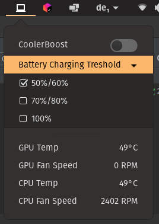

# Gnome extension for ISW (GISW)
- gisw is a GNOME extension that provides a simple frontend for [YoyPa/isw](https://github.com/YoyPa/isw)
in the status area.

## Depends on ISW!
Since gisw is a simple wrapper around isw, a full isw installation is required for it to work.
You can check their installation instructions
[here: REAMDE.md](https://github.com/YoyPa/isw/blob/master/README.md#how-to-install)

Also take a look at their warnings as I provide NO WARRANTY FOR ANYTHING.

## Installation
1. Clone this repo using `git clone https://github.com/kilianfriedrich/gisw/`, or download it over GitHub.
2. Copy all files from `usr` to `/usr`. You could use `rsync -r usr /` for that.
3. Enable via the GNOME extensions app or by entering `gnome-extensions enable gisw@kilianfriedrich.de`
4. Restart your Gnome Shell.
